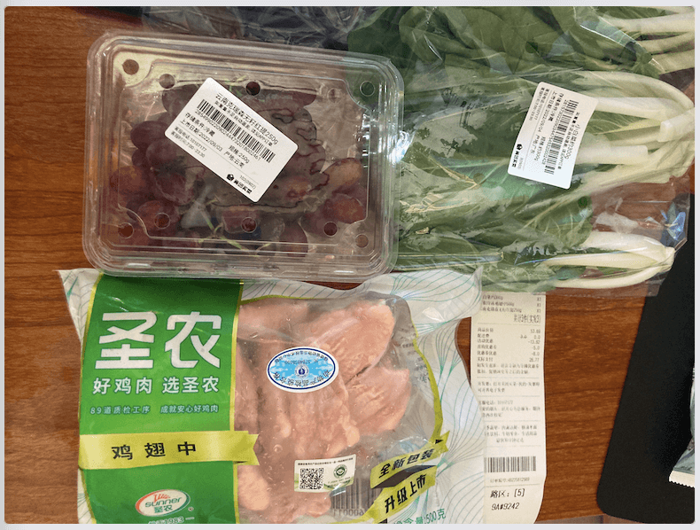
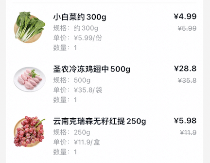
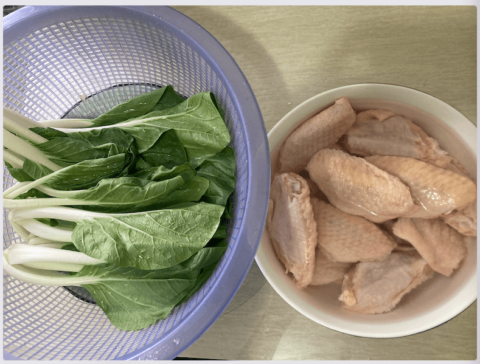
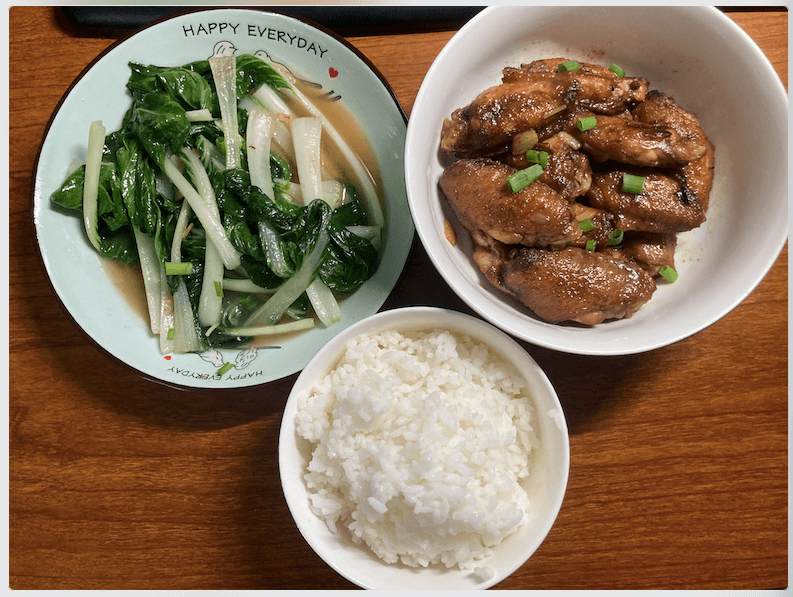
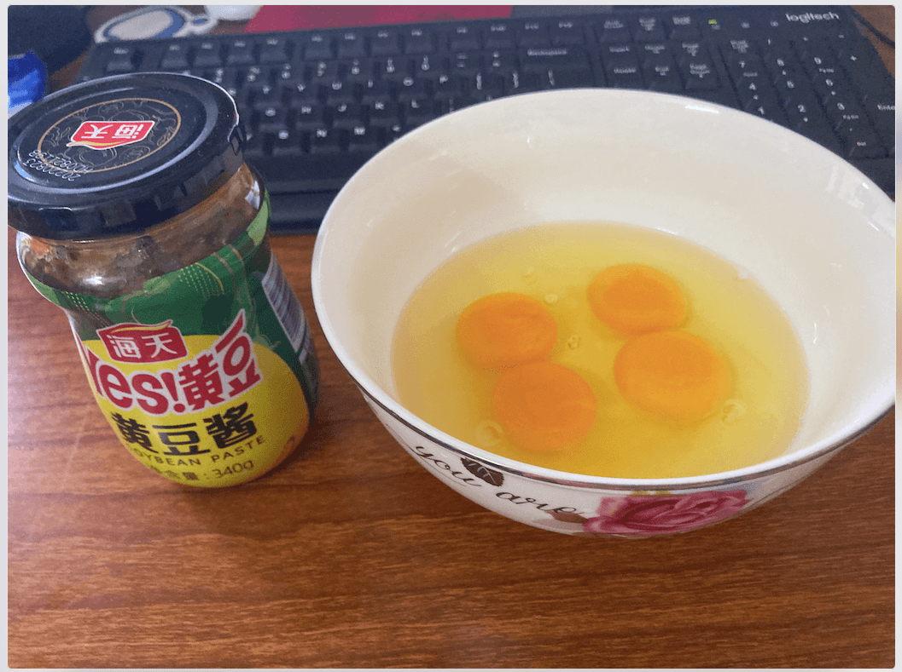
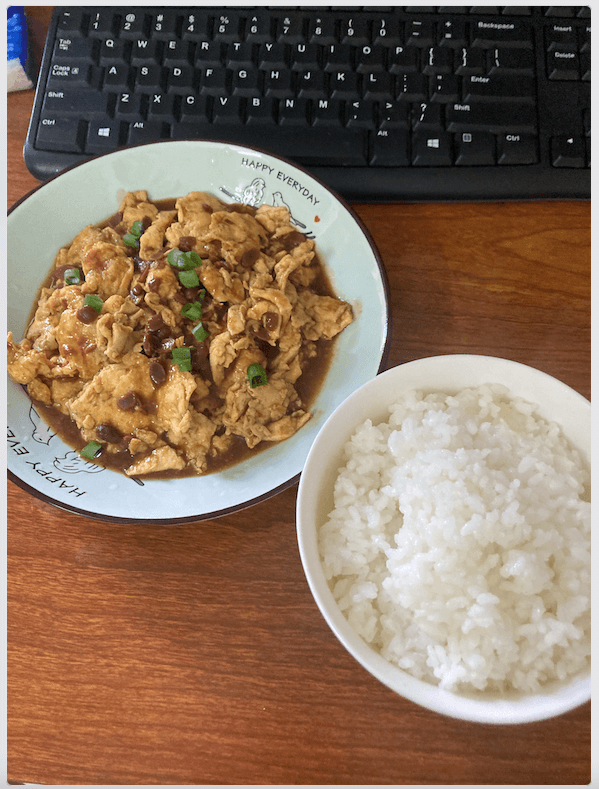
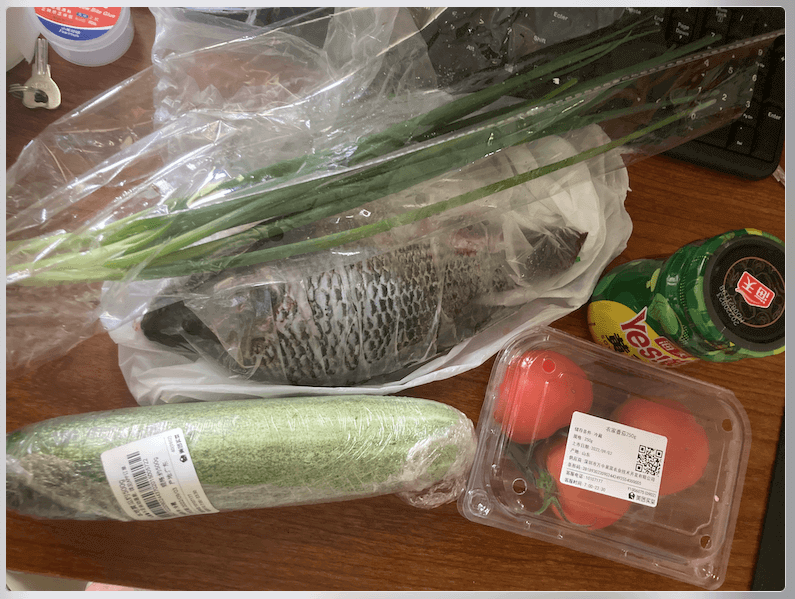
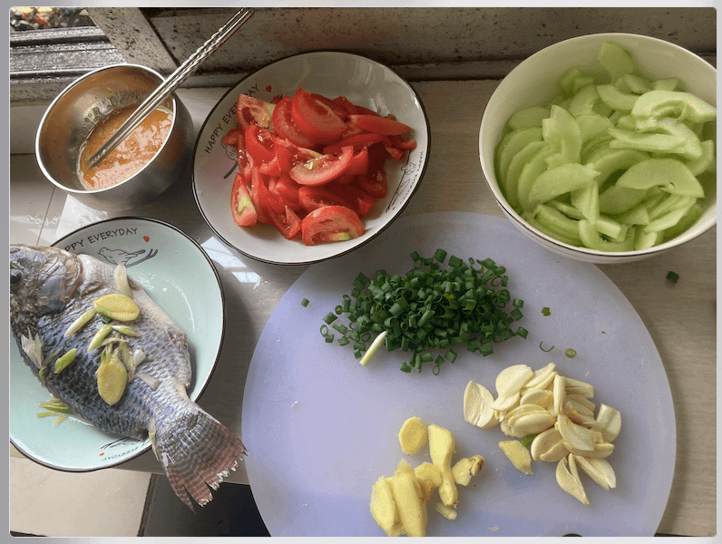
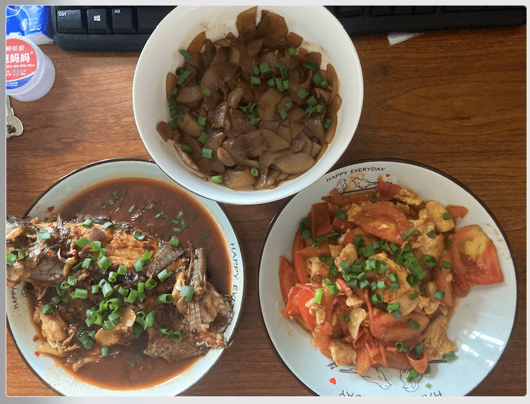
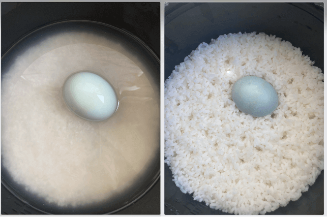

# 做饭日常

## 香煎鸡翅、清炒小白菜(22-09-04)

鸡翅 + 小白菜，晚上，本来计划今天做葱烧豆腐+青椒肉丝，但中午菜到不了，晚餐一餐不能做多，就选了简单的菜。

香煎鸡翅

- 鸡翅放水里提前解冻，解冻后洗干净，用厨房纸吸干水分。开始去腥腌制：料酒+生抽+蓝德+姜片+葱尾部小段，抓匀；蒜片、葱备用；
- 起锅热油，比正常多一点，润锅，加少量盐，防止粘锅、油飞溅。保持中火，依次放入鸡翅，这里 500g 大概 13 只，可以铺满锅底。煎一会再翻面，注意锅中间部分先翻面，煎的两面金黄即可。由于电磁炉受热不均匀，中间部分先煎好的盛出来，都煎好后，盛出，只保留少量油，其余多的倒出备用。下蒜片爆香，再下入之前煎好的鸡翅翻炒，放入少量水（温热），加少量少量生抽、蓝德、胡椒粉、醋，翻炒入味，大火收汁；起锅装盘，撒少量葱花。
- 注意点：煎鸡翅很关键，注意不要开大火，大火可能会煎糊；不要怕不熟，煎太久，这样也可能会糊。这里是加水煮的，有条件可以加可乐（有糖/无糖）；另外撒点熟芝麻可能会更香；

清炒小白菜

- 小白菜洗干净，切掉尾部，用筛子尽量沥干水分，大蒜切片备用。
- 热锅下油，中小火蒜片爆香，放入小白菜翻炒，开大火，炒一会儿放少许盐，彻底断生后，加少量水（温热），放少许生抽、蓝德、醋炒匀，入味。起锅装盘，撒少量葱花。
- 注意点：如果有猪油，炒出来更香。理论上只放少量盐就可以了，但加生抽、蓝德风味可能会更好。

## 酱炒鸡蛋(22-09-04)

买菜晚了，下午 2-3 点才能到，中午先炒一个酱炒鸡蛋(东北菜)，主要是上周买的鸡蛋再不吃就坏了。参考视频：[【酱炒鸡蛋】鸡蛋最好吃的做法！你一定想不到这么简单！3分钟就能搞定～](https://www.bilibili.com/video/BV17t4y1s7EW)

酱炒鸡蛋

- 准备好黄豆酱、鸡蛋四个，打成蛋液，葱备用。如果有青椒、洋葱切点备用；调料汁：黄豆酱 2 小勺（3勺可能会咸）+生抽少许（不要加盐）+清水小半碗（注意是小碗）+老抽少许+香油少许搅匀
- 热锅烧油（油可以多点，鸡蛋液较多）下鸡蛋液，煎熟后，下料汁炒匀入味，（如果有青椒、洋葱这个时候放入）大火收汁。装盘、撒少量葱花。
- 注意点：黄豆酱、生抽都有咸度，我按视频里来，放了三勺，有点咸。所以两小勺就够；另外鸡蛋比较腻，可以放洋葱解腻，🫑 可以增加风味。

## 豆瓣罗非鱼、清炒黄瓜、番茄炒蛋(22-09-03)

米饭 2 杯、咸鸭蛋一个、豆瓣罗非鱼、清炒黄瓜、番茄炒蛋。中午 + 晚上

豆瓣罗非鱼

- 把杀好的罗非鱼洗干净，去掉肚子内黑膜，检查鱼鳞、鱼鳃是否清理干净，剪掉鱼鳍，用厨房纸去除水分。开始去腥腌制：生姜切片+葱尾部切段+料酒+盐，抹匀，肚子里也要有，备好蒜片、豆瓣酱。腌制好后，把葱姜拿掉，去除表面水分。
- 起锅烧热，放比正常量多一点的食用油，润锅，加点盐，防止粘锅，油飞溅，转中火。开始煎鱼，差不多定型后，开始晃动锅，让鱼在锅里充分受热，再翻面，重复之前的动作。煎好鱼后，小火，把鱼移动到锅的一边，另一边放入姜片、蒜片爆香、放入豆瓣酱炒出香味，加少许热水（不要凉水）。转中到大火（尽量中小火，大火可能会碎，后面可以大火收汁），放少许生抽、蓝德、料酒、白胡椒粉、醋、糖、花椒油煮一会儿，翻面，再煮一会儿。汁收的差不多，装盘，撒少许葱花。
- 注意点：水不要多，水不一定要漫过鱼身，可以把汤汁用锅铲不停地浇到正面；电磁炉锅底部不是圆的，受热不均匀，鱼尾煎的时候容易断；煎、煮时翻的次数尽量少，不然就容易碎，出锅时，不要把鱼翻面，朝锅底的煮久了可能不好看；如果鱼比较大，煎之前记得背部改刀；生抽、豆瓣酱都有咸度不要多放，也不要放盐；加水煮时，如果有青椒、花椒就更好了。

清炒黄瓜

- 黄瓜洗净去皮，从中间切开，去掉里面的籽，洗干净，用厨房纸吸干水分，切成适中薄片，不要厚，这样更容易熟。备好大蒜，切片，如果有青椒，可以切成小片备用。
- 开中火下油，放入蒜片爆香，加入黄瓜片，开大火不停翻炒。炒一会儿加点盐（不要多），断生后，加入少量清水（温热），放入蓝德、生抽、醋，翻炒入味，然后大火收汁，装盘，撒少量葱花。
- 注意点：千万不要放老抽，我就是放了，结果成黑色了。醋不要放多，我这里放多了，酸味盖过了本来的味道；注意最好当天买，当天做，之前有买过一次，过了一天尾部直接坏掉。

西红柿炒鸡蛋（番茄炒蛋）

- 西红柿洗干净切片，鸡蛋两个放入小碗中，加点蓝德打匀。切点蒜片备用。
- 热锅下油，先煎鸡蛋，中小火，将蛋液倒入锅中，不要煎的太老，煎好后盛起来。放少量油，蒜爆香，放西红柿翻炒，炒一会儿放少许盐，基本熟后，下鸡蛋，翻炒，加少量水（温热），小火加生抽、糖、蓝德、醋，翻炒入味。装盘、撒少量葱花。
- 注意点：西红柿不能小、不够熟会发酸。有条件加点番茄酱提味；鸡蛋虽然大火油多时可能更香，但会比较油，这种情况可以盛出来点；不加水炒出来可能会比较干。

注意点：

- 调料一定要适量，不能太咸，也不能太酸
- 食材选择要成熟度，比如丝瓜选小个的，大个的可能皮硬，有点老；西红柿买大一点、红一点的，如果成熟度不够会发酸。

## 青椒鸡腿、青椒炒鸡蛋(22-08-28)

米饭 2 杯、咸鸭蛋一个、青椒鸡腿、青椒炒鸡蛋。中午 + 晚上

青椒炒鸡蛋

- 1 个青椒切成小丁、鸡蛋 3 个打散，放点南德。
- 热锅少量油，大火炒青椒，放点盐，炒熟。盛起来放到蛋液中打匀，再下油，下鸡蛋，注意小火，分成小块，翻面。加入生抽、料酒、醋，炒匀、关火。
- 注意点：不需要大蒜、要放料酒去腥、小火防糊。

青椒鸡腿

- 两个鸡腿，切成小块，放生姜、料酒、南德抓匀，腌制一会儿。青椒切成小片，生姜几片、大蒜2-3片。
- 先炒青椒、放盐，炒的基本熟。小火，下生姜、大蒜。下鸡肉，大火炒，发现难炒熟，就放了点水，放南德，生抽、醋，大火煮到基本干，炒匀。
- 注意点：腌制时生姜片要大。不放水可能好点，鸡腿肉切小点。不要厚，这样应该好熟点。

注意

- 多用厨房用纸，刀、盘子、食材等尽量保持干燥。
- 做完饭后，立马洗锅，洗碗，防止后面不想洗，洗好锅后烧热，擦干，挂起，防止生锈（铁锅）。

## 青椒土豆丝、丝瓜炒蛋(22-08-27)

米饭 1 杯、青椒土豆丝、丝瓜炒蛋。晚上

青椒土豆丝

- 1 个青椒、两个中等土豆。青椒切丝，土豆切成细丝，泡水里，去淀粉，大蒜 3 瓣。
- 热锅放油，大蒜爆香，下青椒炒一会，放盐，下土豆丝，大火炒，断生后关火。放盐、南德、生抽，醋，开大火爆炒，炒匀，出锅。
- 注意点：土豆丝一定要细，不然很难炒熟。

丝瓜炒鸡蛋

- 1个丝瓜，切成小段，2个鸡蛋，打散，放点南德
- 大火热油，润锅，倒掉油。再新放点油，下鸡蛋，放点料酒去腥，炒熟，盛起来。下少量油，炒丝瓜，丝瓜本身会有水分，炒熟后下鸡蛋，放盐、生抽、醋，炒匀出锅。
- 注意点：丝瓜不要大，大了可能会老，皮硬。少放油，不然很腻。

注意：

- 一个人一顿饭，如果两个菜 + 米饭，大概率吃不完，除非特意做很小份，或者只做一个菜。少放盐、生抽，有点咸。

