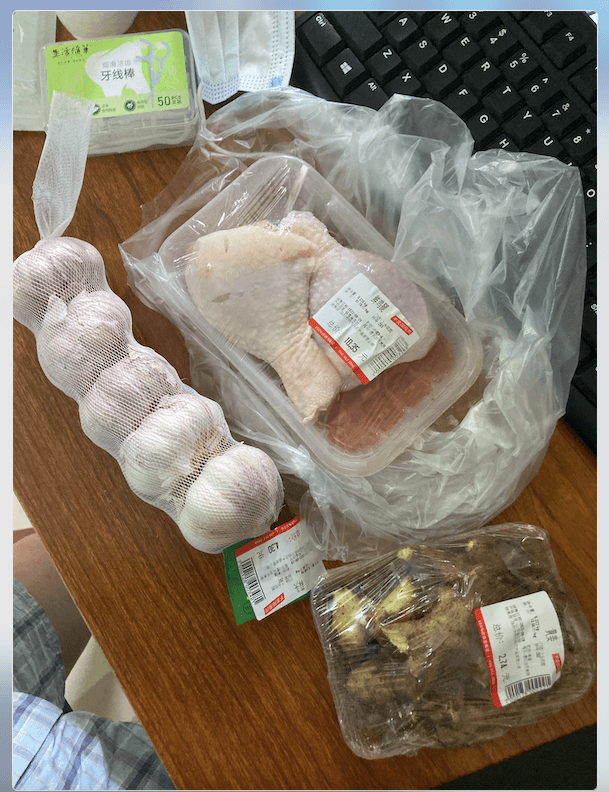
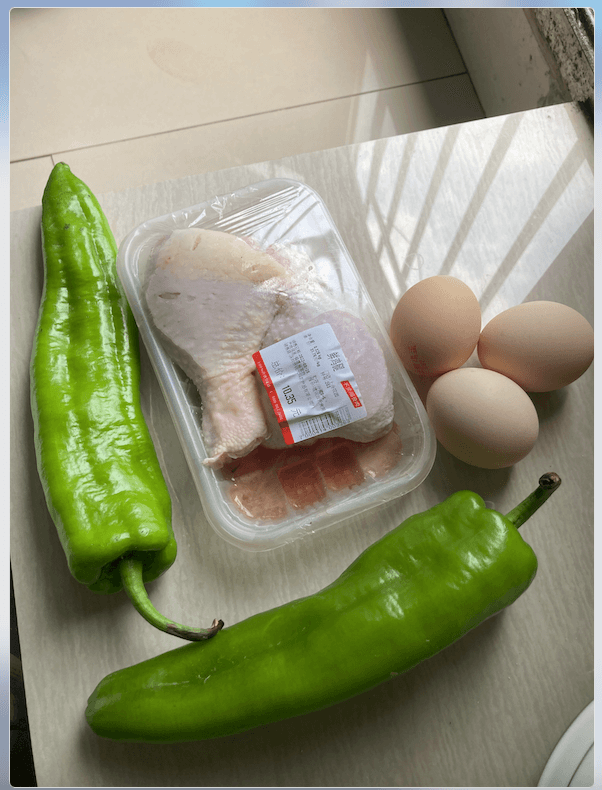
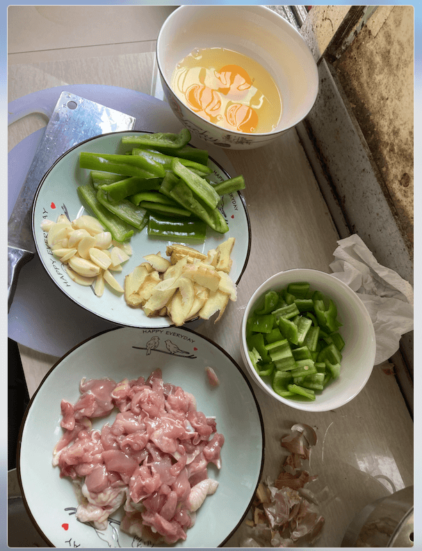
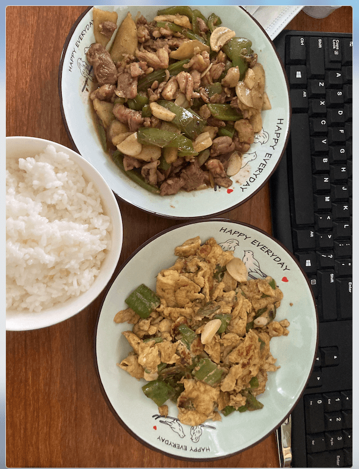
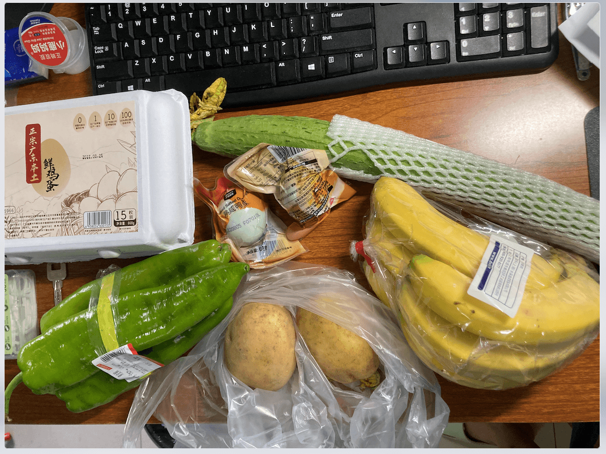
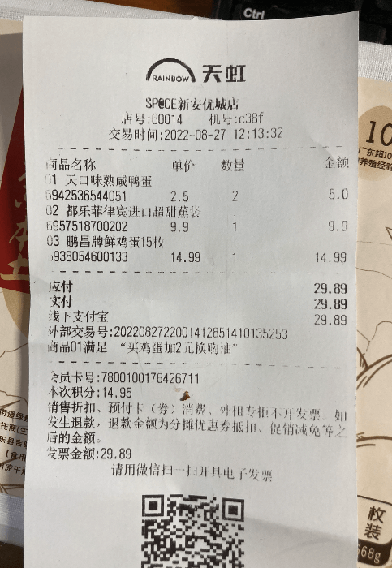
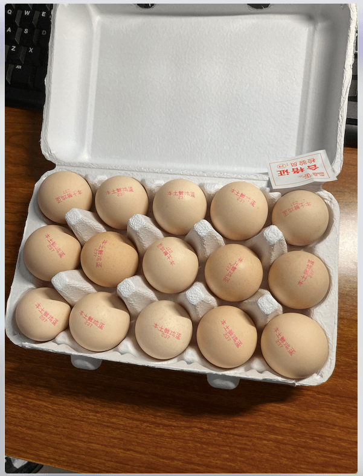
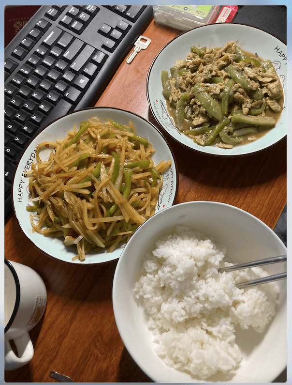

# 做饭日常

## 青椒鸡腿、青椒炒鸡蛋(22-08-28)

米饭 2 杯、咸鸭蛋一个、青椒鸡腿、青椒炒鸡蛋。中午 + 晚上

青椒炒鸡蛋

- 1 个青椒切成小丁、鸡蛋 3 个打散，放点南德。
- 热锅少量油，大火炒青椒，放点盐，炒熟。盛起来放到蛋液中打匀，再下油，下鸡蛋，注意小火，分成小块，翻面。加入生抽、料酒、醋，炒匀、关火。
- 注意点：不需要大蒜、要放料酒去腥、小火防糊。

青椒鸡腿

- 两个鸡腿，切成小块，放生姜、料酒、南德抓匀，腌制一会儿。青椒切成小片，生姜几片、大蒜2-3片。
- 先炒青椒、放盐，炒的基本熟。小火，下生姜、大蒜。下鸡肉，大火炒，发现难炒熟，就放了点水，放南德，生抽、醋，大火煮到基本干，炒匀。
- 注意点：腌制时生姜片要大。不放水可能好点，鸡腿肉切小点。不要厚，这样应该好熟点。

注意

- 多用厨房用纸，刀、盘子、食材等尽量保持干燥。
- 做完饭后，立马洗锅，洗碗，防止后面不想洗，洗好锅后烧热，擦干，挂起，防止生锈（铁锅）。

## 青椒土豆丝、丝瓜炒蛋(22-08-27)

米饭 1 杯、青椒土豆丝、丝瓜炒蛋。晚上

青椒土豆丝

- 1 个青椒、两个中等土豆。青椒切丝，土豆切成细丝，泡水里，去淀粉，大蒜 3 瓣。
- 热锅放油，大蒜爆香，下青椒炒一会，放盐，下土豆丝，大火炒，断生后关火。放盐、南德、生抽，醋，开大火爆炒，炒匀，出锅。
- 注意点：土豆丝一定要细，不然很难炒熟。

丝瓜炒鸡蛋

- 1个丝瓜，切成小段，2个鸡蛋，打散，放点南德
- 大火热油，润锅，倒掉油。再新放点油，下鸡蛋，放点料酒去腥，炒熟，盛起来。下少量油，炒丝瓜，丝瓜本身会有水分，炒熟后下鸡蛋，放盐、生抽、醋，炒匀出锅。
- 注意点：丝瓜不要大，大了可能会老，皮硬。少放油，不然很腻。

注意：

- 一个人一顿饭，如果两个菜 + 米饭，大概率吃不完，除非特意做很小份，或者只做一个菜。少放盐、生抽，有点咸。

